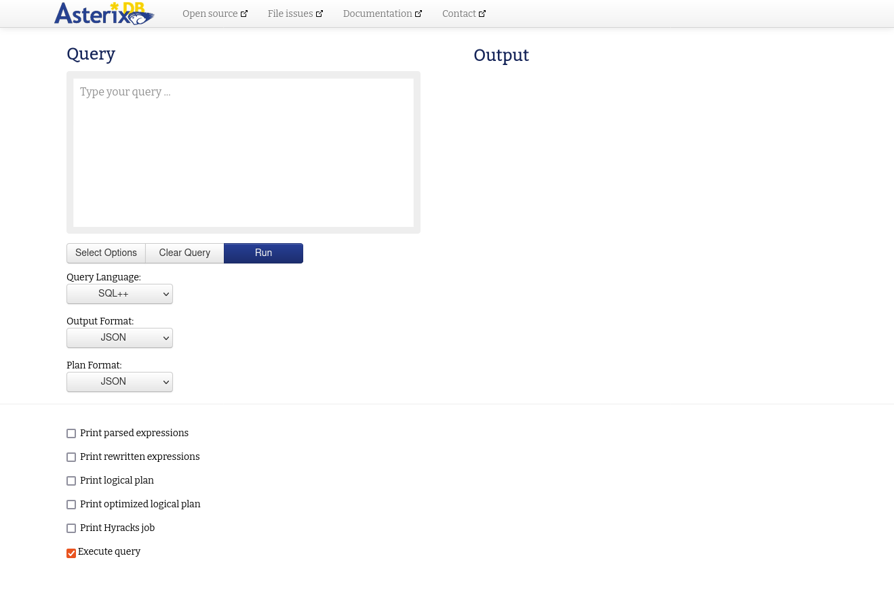

# Installing AsterixDB

This tutorial illustrates how to download and install AsterixDB and provides the fastest way to set up a single-machine sample instance of AsterixDB using the included helper scripts. 

---

## Table of Contents

* [Specifications](#specifications)
* [Prerequisites](#prerequisites)
* [Steps](#steps)
* [Test Your Installation](#test-your-installation)

---

## Specifications
The following tutorial is run on `Ubuntu 22.04` operating system.


## Prerequisites
* __JDK 11__  
    For `Ubuntu` you can simply use the following command:
    ```bash
    $ sudo apt-get install openjdk-11-jdk
    ```
    Or, you can find the full JDK installation instructions in [https://openjdk.org/install/](https://openjdk.org/install/).  
    > _Make sure to install the JDK package not the JRE one_
    


## Steps
1. Download the latest version of AsterixDB through the official [downloads page](https://asterixdb.apache.org/download.html).  
    > _Make sure to select the option for **Simple Server Package**_
    

2. Extract the zip file into the desired location.

3. That's it! You are ready to go.


## Test Your Installation
1. Open a new terminal and navigate to the `apache-asterixdb` *inside* the folder you just extracted.  
    ```bash
    $ cd path/to/asterix-server/apache-asterixdb
    ```
    or you can just navigate to the folder from the file manager then 
    ```Right Click -> Open in Terminal```

2. Change the current directory to `opt/local/bin`.
    ```bash
    $ cd opt/local/bin
    ```

3. Run the script `start-sample-cluster.sh` to start the cluster.
    ```bash
    $ ./start-sample-cluster.sh
    ```
    Wait until the command has finished executing and returned. If everything is successful, you should see an output like this:
    > ```
    > CLUSTERDIR=/home/ubuntu/asterix-server-0.9.8-binary-assembly/apache-asterixdb-0.9.8/opt/local
    > INSTALLDIR=/home/ubuntu/asterix-server-0.9.8-binary-assembly/apache-asterixdb-0.9.8
    > LOGSDIR=/home/ubuntu/asterix-server-0.9.8-binary-assembly/apache-asterixdb-0.9.8/opt/local/logs
    > 
    > INFO: Starting sample cluster...
    > INFO: Waiting up to 90 seconds for cluster 127.0.0.1:19002 to be available.
    > INFO: Cluster started and is ACTIVE.
    >
    > $
    > ```

    Now, there should be a running AsterixDB cluster on the machine.

4.  Open your favorite web browser to access the web interface.
5. Go to 
[http://localhost:19006](http://localhost:19006) for the newer web interface  
or [http://localhost:19001](http://localhost:19001) for the old one   
and here you can run queries interactively and see what it does.  
    >__NOTE__:  
    [http://localhost:**19006**](http://localhost:19006) is the newer interface and I'll be using it for the next tutorials.

5. Finally, after finishing your work, remember to close the cluster using the script `stop-sample-cluster.sh` which is in the same directory as the starting script.
    ```bash
    $ ./stop-sample-cluster.sh
    ```
    Again, wait until the command has finished executing and returned. If everything is successful, you should see an output like this: 
    > ```
    > INFO: Attempting to shutdown cluster 127.0.0.1:19002...
    > INFO: Cluster 127.0.0.1:19002 accepted shutdown request.
    > INFO: Waiting up to 60s for cluster to shutdown............done.
    >
    > $
    > ```
    And this is a screenshot of how the terminal may look like after running the commands above.
        

7. That's it! Now you have successfully installed AsterixDB on your machine and you're good to go.  
