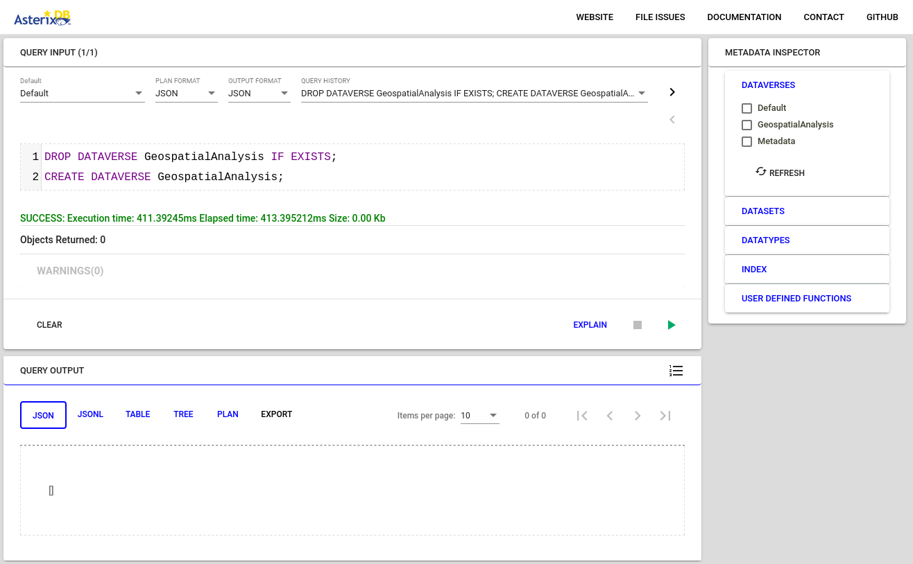
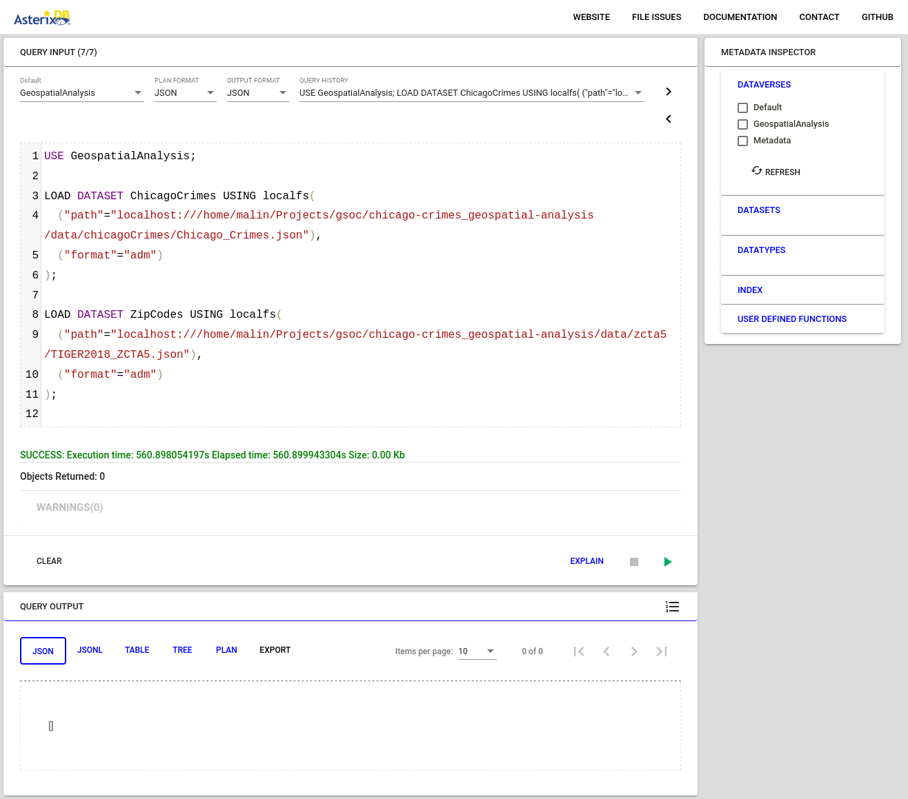
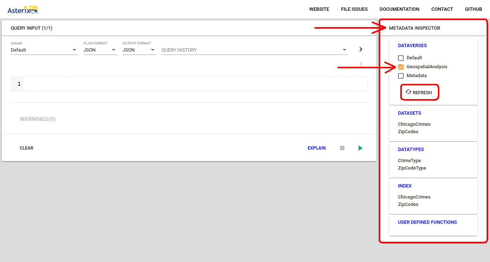

# Loading the Datasets

This tutorial illustrates how to create  dataveses, datatypes, and datasets to load actual data into AsterixDB.

---

## Table of Contents
* [Specifications](#specifications)
* [Prerequisites](#prerequisites)
* [Steps](#steps)
* [Important Note](#important-note)

---

## Specifications
The following tutorial is run on `Ubuntu 22.04` operating system.

## Prerequisites
* __AsterixDB__  
    You should have a working installation of AsterixDB on your machine. Refer to [installing AsterixDB](../Installing%20AsterixDB/installing_asterixdb.md) tutorial for instructions on how to download and install AsterixDB.

* __Chicago Crimes & Zip Codes Datasets__  
    You should have the *Chicago Crimes* and *Zip Codes* datasets somewhere on your machine. You can execute the script [get_data.sh](../../get_data.sh) to download them for you from [https://star.cs.ucr.edu](https://star.cs.ucr.edu).


## Steps

1. Start an instance of the sample cluster and go to the web interface at [http://localhost:19006](http://localhost:19006).

2. In the web interface you can see an area where you can write your queries and a button to execute them. 


3. Create a new dataverse and let's call it `GeospatialAnalysis`. 
    To do so, execute the following query in your web interface.
    ```SQL
    DROP DATAVERSE GeospatialAnalysis IF EXISTS;
    CREATE DATAVERSE GeospatialAnalysis;
    ```
    
    
4. Create `CrimeType` datatype for the *Chicago Crimes* dataset and `ZipCodeType` for the *Zip Codes* datasets. 
    To do so, execute the following query.
    ```SQL
    USE GeospatialAnalysis;

    CREATE TYPE CrimeType AS {
        ID: string,
        g: geometry
    };

    CREATE TYPE ZipCodeType AS {
        `GEOID10`: string,
        `g`: geometry
    };
    ```

5. Create two new **datasets** called `ChicagoCrimes` and `ZipCodes` that use the datatypes we just created. Notice that we have to explicitly specify the primary key for each dataset as `ID` and `GEOID10` which are members of their respective datatype.
    ```SQL
    USE GeospatialAnalysis;

    CREATE DATASET ChicagoCrimes(CrimeType)
        PRIMARY KEY ID;

    CREATE DATASET ZipCodes(ZipCodeType)
        PRIMARY KEY `GEOID10`;
    ```  

6. Now, load the dataset from your hard drive into the dataset of AsterixDB. To do so, modify the following query, replacing the curly braces and the text inside it with the actual absolute path to each dataset on your machine. (This might take a while depending on the size of the dataset)
    ```SQL
    USE GeospatialAnalysis;

    LOAD DATASET ChicagoCrimes USING localfs(
        ("path"="localhost://{/absolute/path/to/Chicago_Crimes.json}"),
        ("format"="adm")
    );

    LOAD DATASET ZipCodes USING localfs(
        ("path"="localhost://{/absolute/path/to/TIGER2018_ZCTA5.json}"),
        ("format"="adm")
    );
    ```
    An example query after modification can be:
    ```SQL
    USE GeospatialAnalysis;

    LOAD DATASET ChicagoCrimes USING localfs(
        ("path"="localhost:///home/malin/Downloads/data/Chicago_Crimes.json"),
        ("format"="adm")
    );

    LOAD DATASET ZipCodes USING localfs(
        ("path"="localhost:///home/malin/Downloads/data/zcta5/TIGER2018_ZCTA5.json"),
        ("format"="adm")
    );
    ```
    


7. That's it! You now have successfully loaded the dataset to AsterixDB. You can verify this by clicking the *refresh* button under *METADATA INSPECTOR* and then ticking the checkbox *GeospatialAnalysis*. You can also click on the dataset name to see its details and even a sample entry from it.
  

8. Bonus step: You can always combine the above into one big query that does everything. Check this out:
    ```SQL
    DROP DATAVERSE GeospatialAnalysis IF EXISTS;
    CREATE DATAVERSE GeospatialAnalysis;

    USE GeospatialAnalysis;

    CREATE TYPE CrimeType AS {
        ID: string,
        g: geometry
    };

    CREATE TYPE ZipCodeType AS {
        `GEOID10`: string,
        `g`: geometry
    };

    CREATE DATASET ChicagoCrimes(CrimeType)
        PRIMARY KEY ID;

    CREATE DATASET ZipCodes(ZipCodeType)
        PRIMARY KEY `GEOID10`;

    LOAD DATASET ChicagoCrimes USING localfs(
        ("path"="localhost://{/absolute/path/to/Chicago_Crimes.json}"),
        ("format"="adm")
    );

    LOAD DATASET ZipCodes USING localfs(
        ("path"="localhost://{/absolute/path/to/TIGER2018_ZCTA5.json}"),
        ("format"="adm")
    );
    ```
    And again, don't forget to modify the path to the dataset on your hard drive. But I would argue that it'd be better done in step-by-step manner as it makes it easy to spot and fix simple mistakes.  

## Important Note
You don't have to load the dataset everytime you start a cluster. Everything you do on the cluster is perserved between sessions, even if you restart your computer.
