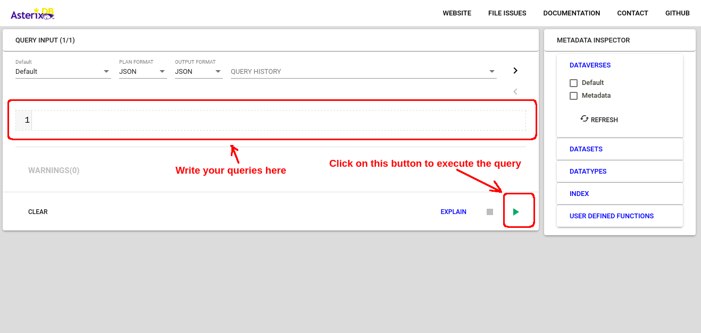

# Simple Data Analysis Questions

This tutorial illustrates how to answer create simple questions about a dataset using AsterixDB.

---

## Table of Contents
* [Specifications](#specifications)
* [Prerequisites](#prerequisites)
* [Steps](#steps)
* [Questions](#questions)

---

## Specifications
The following tutorial is run on `Ubuntu 22.04` operating system.

## Prerequisites
* Previous tutorial: __Loading the Datasets__  
    You should have the datasets already loaded into AsterixDB and completed the steps described in the [Loading the Datasets](../Loading%20the%20Datasets/loading_the_datasets.md) tutorial.

## Steps

1. Start an instance of the sample cluster if you don't have it running already, and go to the web interface at [http://localhost:19006](http://localhost:19006).

2. In the web interface, feel free to execute any of the queries listed below in the [Questions](#questions) section to find the answer to it. 


## Questions

1. Which police district has the most crimes?
    ```SQL
    USE GeospatialAnalysis;

    SELECT District, COUNT(1) AS NumberOfCrimes
    FROM ChicagoCrimes
    GROUP BY District
    ORDER BY NumberOfCrimes DESC
    LIMIT 1;
    ```

2. Which police district has the most arrest percentage?
    ```SQL
    USE GeospatialAnalysis;

    SELECT District, SUM(int32(boolean(Arrest)))/COUNT(1) AS PercentageOfArrests
    FROM ChicagoCrimes
    GROUP BY District
    ORDER BY PercentageOfArrests DESC
    LIMIT 1;
    ```

3. How many murder crimes happen on the street?
    ```SQL
    USE GeospatialAnalysis;

    SELECT COUNT(1) AS NumberOfCrimesOnStreet
    FROM ChicagoCrimes
    WHERE `Location Description` = "STREET" AND `Primary Type` = "HOMICIDE";
    ```

4. Where does murder crimes usually happen? (ZIP Code)
    ```SQL
    USE GeospatialAnalysis;

    SELECT z.GEOID10, COUNT(1) AS NumberOfCrimes
    FROM ChicagoCrimes c JOIN ZipCodes z ON st_contains(z.g, c.g) = true
    GROUP BY z.`GEOID10`
    ORDER BY NumberOfCrimes DESC
    LIMIT 5;
    ```

5. Where does murder crimes usually happen? (Location Description)
    ```SQL
    USE GeospatialAnalysis;

    SELECT `Location Description`, COUNT(1) AS NumberOfCrimes
    FROM ChicagoCrimes
    WHERE `Primary Type` = "HOMICIDE"
    GROUP BY `Location Description`
    ORDER BY `NumberOfCrimes` DESC;
    LIMIT 5;
    ```

6. What is the time of day when murder and kidnapping happen the most?
    ```SQL
    USE GeospatialAnalysis;

    SELECT CrimeHour, COUNT(1) AS NumberOfCrimes
    FROM ChicagoCrimes
    WHERE `Primary Type` = "HOMICIDE" OR `Primary Type` = "KIDNAPPING"
    GROUP BY get_hour(parse_datetime(Date,"M/D/Y h:m:s a")) AS CrimeHour
    ORDER BY NumberOfCrimes DESC
    LIMIT 1;
    ```

7. What is the most common domestic crime?
    ```SQL
    USE GeospatialAnalysis;

    SELECT `Primary Type`, COUNT(1) AS NumberOfCrimes
    FROM ChicagoCrimes
    WHERE `Domestic` = "true"
    GROUP BY `Primary Type`
    ORDER BY NumberOfCrimes DESC
    LIMIT 1;
    ```

8. What is the percentage of domestic crimes that led to an arrest?
    ```SQL
    USE GeospatialAnalysis;

    SELECT SUM(int32(boolean(Arrest)))/COUNT(1) AS PercentageOfArrests
    FROM ChicagoCrimes
    WHERE Domestic='true';
    ```

9. Which day of week has the most domestic crimes?
    ```SQL
    USE GeospatialAnalysis;

    SELECT Day, COUNT(1) AS NumberOfCrimes
    FROM ChicagoCrimes
    WHERE`Domestic` = 'true'
    GROUP BY day_of_week(parse_datetime(Date,"M/D/Y h:m:s a")) AS Day
    ORDER BY NumberOfCrimes DESC
    LIMIT 1;
    ```

10. What is the most common crime in each day of week?
    ```SQL
    USE GeospatialAnalysis;

    WITH CrimesPerDay AS (
    SELECT Day, `Primary Type`, COUNT(1) AS NumberOfCrimes
    FROM ChicagoCrimes c
    GROUP BY day_of_week(parse_datetime(Date,"M/D/Y h:m:s a")) AS Day, `Primary Type`
    )

    SELECT a.Day, a.`Primary Type`, a.NumberOfCrimes
    FROM CrimesPerDay a INNER JOIN (
        SELECT Day, MAX(NumberOfCrimes) AS NumberOfCrimes
        FROM CrimesPerDay
        GROUP BY Day
    ) b ON a.Day = b.Day AND a.NumberOfCrimes = b.NumberOfCrimes
    ORDER BY a.Day;
    ```

11. Which month generally has the greatest number of crimes?
    ```SQL
    USE GeospatialAnalysis;

    SELECT Month, COUNT(1) AS NumberOfCrimes
    FROM ChicagoCrimes
    GROUP BY get_month(parse_datetime(Date,"M/D/Y h:m:s a")) AS Month
    ORDER BY NumberOfCrimes DESC
    LIMIT 1;
    ```

12. What is the time of day when theft-related crimes happen the most?
    ```SQL
    USE GeospatialAnalysis;

    SELECT CrimeHour, COUNT(1) AS NumberOfCrimes
    FROM ChicagoCrimes
    WHERE `Primary Type` = "MOTOR VEHICLE THEFT" OR
        `Primary Type` = "BURGLARY" OR
        `Primary Type` = "ROBBERY" OR
        `Primary Type` = "THEFT"
    GROUP BY get_hour(parse_datetime(Date,"M/D/Y h:m:s a")) AS CrimeHour
    ORDER BY NumberOfCrimes DESC
    LIMIT 1;
    ```

13. What is the most common crime in each area?
    ```SQL
    USE GeospatialAnalysis;

    WITH CrimesPerZipCode AS (
    SELECT z.GEOID10 AS `Zip Code`, c.`Primary Type`, COUNT(1) AS NumberOfCrimes
    FROM ChicagoCrimes c JOIN ZipCodes z ON st_contains(z.g, c.g) = true
    GROUP BY z.GEOID10, c.`Primary Type`
    )

    SELECT a.`Zip Code`, a.`Primary Type`, a.NumberOfCrimes
    FROM CrimesPerZipCode a INNER JOIN (
        SELECT `Zip Code`, MAX(NumberOfCrimes) AS NumberOfCrimes
        FROM CrimesPerZipCode
        GROUP BY `Zip Code`
    ) b ON a.`Zip Code` = b.`Zip Code` AND a.NumberOfCrimes = b.NumberOfCrimes
    ```

