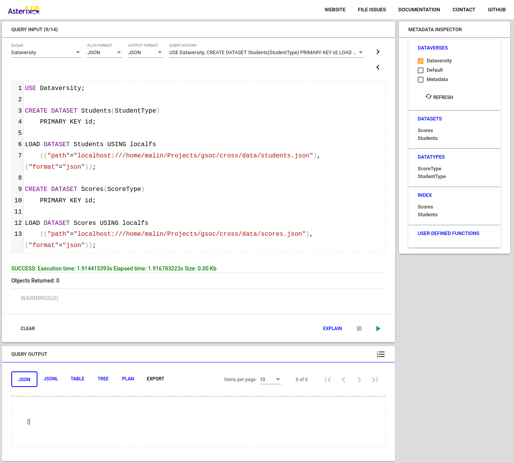

# Installing AsterixDB & Loading a Dataset to AsterixDB and Analyzing It.

## Table of Contents
* [Simple Server Package](#simple-server-package)
    * [Specifications](#specifications)
    * [Prerequisites](#prerequisites)
    * [Steps](#steps)
    * [Run an Example](#run-an-example--test-your-installation)
* [Loading a Dataset](#loading-a-dataset)
    * [Specifications](#specifications-1)
    * [Prerequisites](#prerequisites-1)
    * [Important Definitions](#important-definitions)
    * [Steps](#steps-1)
* [Analyzing the Dataset](#analyzing-the-dataset)
    * [Specifications](#specifications-2)
    * [Prerequisites](#prerequisites-2)
    * [Steps](#steps-2)

---

## Simple Server Package
This option is the fastest way to set up a single-machine sample instance of AsterixDB using the included helper scripts. 


### Specifications
The following tutorial is run on `Ubuntu 20.04` operating system.


### Prerequisites
* __JDK__  
You can find the JDK installation instructions in [this link](https://openjdk.org/install/).  
    > _Make sure to install the JDK package not the JRE one_
    


### Steps
1. Download the latest version of AsterixDB through the official [downloads page](https://asterixdb.apache.org/download.html).  
    > _Make sure to select the option for **Simple Server Package**_
    

2. Extract the zip file into your desired location.

3. That's it! You are ready to go.


### Run an Example / Test Your Installation
1. Open a new terminal and navigate to the `apache-asterixdb` inside the folder you just extracted.  
    ```bash
    cd path/to/asterix-server/apache-asterixdb
    ```
    or you can just navigate to the folder from the file manager then 
    ```Right Click -> Open in Terminal```

2. Change the current directory to `opt/local/bin`.
    ```bash
    cd opt/local/bin
    ```

3. Run the script `start-sample-cluster.sh` to start the cluster.
    ```bash
    ./start-sample-cluster.sh
    ```
    Wait until the command has finished executing and returned. If everything is successful, you should see an output like this:
    > ```
    > CLUSTERDIR=/home/ubuntu/asterix-server-0.9.8-binary-assembly/apache-asterixdb-0.9.8/opt/local
    > INSTALLDIR=/home/ubuntu/asterix-server-0.9.8-binary-assembly/apache-asterixdb-0.9.8
    > LOGSDIR=/home/ubuntu/asterix-server-0.9.8-binary-assembly/apache-asterixdb-0.9.8/opt/local/logs
    > 
    > INFO: Starting sample cluster...
    > INFO: Waiting up to 90 seconds for cluster 127.0.0.1:19002 to be available.
    > INFO: Cluster started and is ACTIVE.
    >
    > $
    > ```

4. Now, there should be a running AsterixDB cluster on the machine. You can access it via the web interface at 
[http://localhost:19006](http://localhost:19006)  
or [http://localhost:19001](http://localhost:19001)   
and try running queries and see what it does.  
    >__NOTE__:  
    [http://localhost:**19006**](http://localhost:19006) is the newer interface and I'll be using it for the next tutorials if needed.

5. Finally, after finishing your work, remember to close the cluster using the script `stop-sample-cluster.sh` which is in the same directory as the starting script.
    ```bash
    ./stop-sample-cluster.sh
    ```
    Again, wait until the command has finished executing and returned. If everything is successful, you should see an output like this: 
    > ```
    > INFO: Attempting to shutdown cluster 127.0.0.1:19002...
    > INFO: Cluster 127.0.0.1:19002 accepted shutdown request.
    > INFO: Waiting up to 60s for cluster to shutdown............done.
    >
    > $
    > ```

And this is a screenshot of how the terminal should look like after running the commands above.
    


---

## Loading a Dataset

### Specifications
The following tutorial is run on `Ubuntu 20.04` operating system.

### Prerequisites
* AsterixDB
    : You should have a working installation of AsterixDB. You can find the installation instructions in the [section above](#simple-server-package).

### Important Definitions
* Dataverse
    :  A dataverse is a place (similar to a database in a relational DBMS) which can be used to create and manage the types, datasets, functions, and other artifacts for a given AsterixDB application. You can think of a dataverse as a namespace that contains datatypes and datasets.

* Datatype
    : A datatype tells AsterixDB what you know (or more accurately, what you want it to know) a priori about one of the kinds of data instances that you want AsterixDB to hold for you. It is the main building block of datasets as it defines the types used in each dataset. You can think of the datatype as a custom class and the dataset is an array of that class.  

    However, note that, datatypes can be `open` (default) or `closed`. Instances of `open` datatypes are permitted to have additional content, beyond what the datatype says, as long as they at least contain the information described by the datatype definition. Subsequently, instanced of `closed` datatypes are not permitted to have additional content and will be restricted to have only the information in the datatype definition.

* Dataset
    : A dataset is a collection of data instances of a datatype, and AsterixDB makes sure that the data instances that you put in it conform to its specified type. Datasets are similar to tables in relational DBMSs.

### Steps
For this section of the tutorial we will be using fictional information of a university. We have two datasets `Student` and `Scores` that are shown in the following tables.  

<!-- | id  | first_name | last_name | zip_code |
| --- | ---------- | --------- | -------- |
| 157 | Mia        | Palmer    | 91762    |
| 223 | Lee        | Tanner    | 91770    |
| 281 | Livia      | Osborn    | 94601    |
| 284 | Oscar      | Miles     | 90066    |
| 345 | Rebecca    | George    | 91732    |
| 122 | Lewis      | Bradley   | 92805    |
| 151 | Jake       | Sharp     | 91331    |
| 162 | Lacey      | Tanner    | 93307    |
| 211 | David      | Grant     | 92021    |
| 323 | Jake       | Pearce    | 94087    | -->

[Student](data/students.json)  
  

<!-- | id  | math | programming | physics | Grade     |
| --- | ---- | ----------- | ------- | --------- |
| 157 | 92   | 94          | 95      | Excellent |
| 223 | 88   | 77          | 86      | Good      |
| 281 | 83   | 95          | 83      | Excellent |
| 284 | 78   | 79          | 94      | Good      |
| 345 | 72   | 90          | 82      | Good      |
| 122 | 89   | 88          | 92      | Excellent |
| 151 | 93   | 82          | 91      | Excellent |
| 162 | 75   | 94          | 85      | Good      |
| 211 | 87   | 97          | 90      | Excellent |
| 323 | 83   | 92          | 88      | Excellent | -->

[Scores](data/scores.json)  
  

1. First of all, [start an instance of the sample cluster](#run-an-example--test-your-installation). In the web interface you can see an area to write your queries and a button to execute them. 
For the next two steps, we will perform preparation steps before actually loading the data itself. The preparation steps are 'Defining the dataverse' and 'Defining the datatypes'.

<!-- And, you can view the datasets and dataypes in each dataverse by ticking the checkbox next to the dataverse name. -->

2. Create a new dataverse for our data and call it `Dataversity`. 
    To do so, execute the following query in your web interface.
    ```SQL
    DROP DATAVERSE Dataversity IF EXISTS;
    CREATE DATAVERSE Dataversity;
    ```
    > __Explanation__:  
    > Since you can't create a dataverse with a given name if there's an existing dataverse with the same name, we first delete `Dataversity` if it exists then we create a new dataverse with the same name.

    After executing the query, you can see in the right section of the page and under `METADATA INSPECTOR` that the running instance has three dataverses; `Default`, `Metadata`, and `Dataversity`. 
    The first two Dataverses are there by default and we will be using the dataverse we just created to store our datatypes and datasets.
    > __Note__:  
    > If you can't see the newly created dataverse, press the refresh button.  

      

3. Create `StudentType` datatype for the Students dataset and `ScoreType` for the Scores datasets. 
    To do so, execute the following query.
    ```SQL
    USE Dataversity;

    CREATE TYPE StudentType AS closed {
        id: int,
        first_name: string,
        last_name: string,
        zip_code: string
    };

    CREATE TYPE ScoreType AS {
        id: int,
        math: int,
        programming: int,
        physics: int
    };
    ```

    > __Explanation__:  
    > The first line in the query above selects the dataverse we will be working on. Then for that dataverse we create a new type and call it `StudentType`. The new type consists of multiple types of data according to the dataset. The same thing is done for the `ScoreType`. 
    
    > __Note__:  
    > The *grade* field is purposefully omitted from the ScoreType to demonstrate a useful feature in AsterixDB. This field will be automatically created later by AsterixDB while it is loading the dataset. Because, unlike the StudentType, the ScoreType is *Open* (not closed), this means it allows this behavior of adding more fields.

    > __Note__:  
    > You can find the full list of the types you can use in [this link](https://asterixdb.apache.org/docs/0.9.8/datamodel.html).
    
    Again, you can verify the execution of your query through the *response status* and the *metadata inspector*.

4. Create and load the `Students` and `Scores` datasets with the following query.
    ```SQL
    USE Dataversity;

    CREATE DATASET Students(StudentType)
        PRIMARY KEY id;
        
    LOAD DATASET Students USING localfs
        (("path"="localhost://{/home/username/absolute/path/to/students.json}"),("format"="json"));

    CREATE DATASET Scores(ScoreType)
        PRIMARY KEY id;

    LOAD DATASET Scores USING localfs
        (("path"="localhost://{/home/username/absolute/path/to/scores.json}"),("format"="json"));
    ```  
    > __Note__:  
    > Before executing the query above, replace the paths between the curly brackets **{...}** with the actual path to the `students.json` and `scores.json` on your machine and remove the curly brackets.   

    > __Explanation__:  
    > Again, the first thing we do is specifying the dataverse that we will be working with. Then we create a dataset and call it `Students` that contains instances conforming to the *StudentType* datatype and that it has a primary key which is the *id* field of each instance. Finally we load the dataset from a local file that is stored in `/home/username/absolute/path/to/scores.json` which should be replaced by the actual path to the file. The same thing is repeated for the `Scores` dataset.

    

And these are the steps in a single query.
```SQL
DROP DATAVERSE Dataversity IF EXISTS;
CREATE DATAVERSE Dataversity;

USE Dataversity;

CREATE TYPE StudentType AS {
    id: int,
    first_name: string,
    last_name: string,
    zip_code: string
};

CREATE TYPE ScoreType AS {
    id: int,
    math: int,
    programming: int,
    physics: int,
    grade: string
};

CREATE DATASET Students(StudentType)
    PRIMARY KEY id;
    
LOAD DATASET Students USING localfs
    (("path"="localhost://{/home/username/absolute/path/to/students.json}"),("format"="json"));

CREATE DATASET Scores(ScoreType)
    PRIMARY KEY id;

LOAD DATASET Scores USING localfs
    (("path"="localhost://{/home/username/absolute/path/to/scores.json}"),("format"="json"));
```

---

## Analyzing the Dataset

### Specifications

### Prerequisites

### Steps
